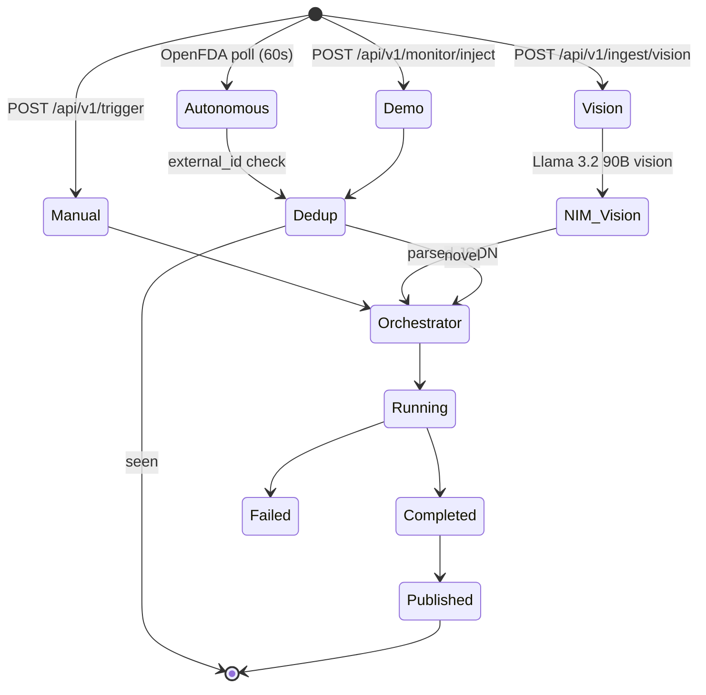
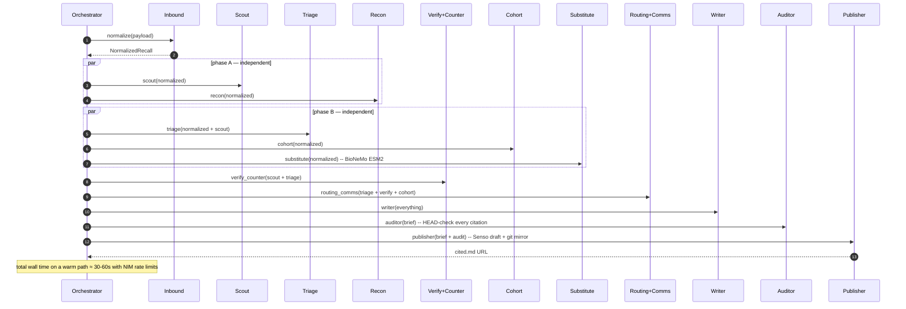
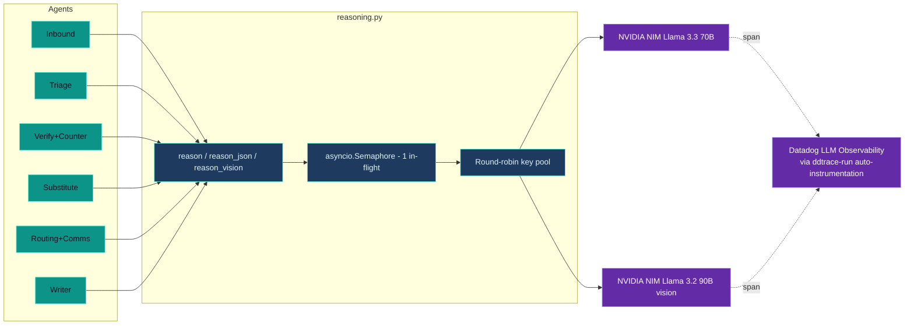
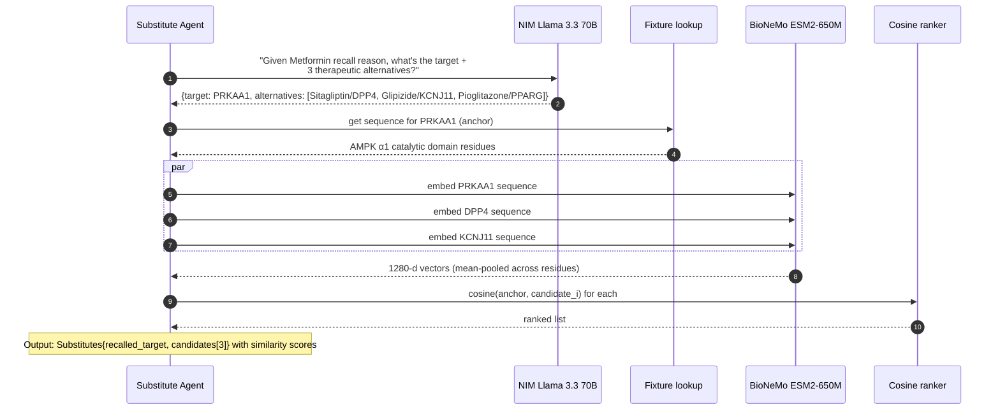
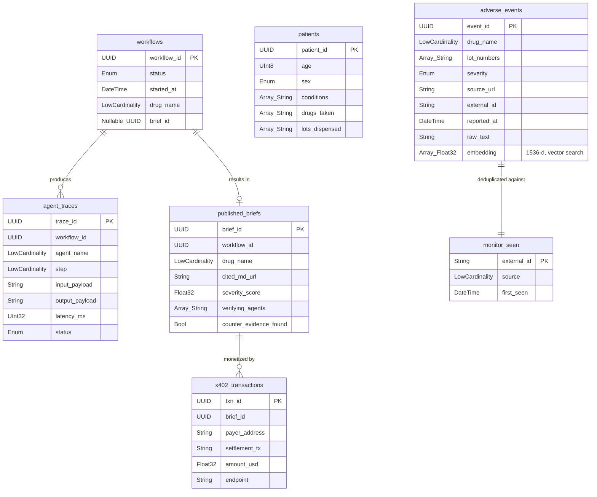

# Reflex — Architecture & Technical Deep Dive

This document goes one layer below the [README](./README.md) to explain how every component is built, why we made each design choice, and how the pieces fit together end-to-end.

---

## 1. Runtime topology

```mermaid

flowchart TB
    subgraph BROWSER[Browser]
        UI[Next.js 14 App Router<br/>localhost:3000]
        CV[AgentTheater Canvas<br/>requestAnimationFrame loop]
        MOL[MoleculePreview<br/>3Dmol.js + PubChem]
        NAR[Narrator<br/>SpeechSynthesis API]
    end

    subgraph SERVER[Local Python process — uvicorn under ddtrace-run]
        API[FastAPI app<br/>localhost:8000]
        MON[Autonomous Monitor<br/>asyncio task, 60s tick]
        ORC[Orchestrator<br/>11-agent scheduler]
        BUS[Trace Bus<br/>asyncio Queues per workflow]
        SSE[SSE endpoint /api/v1/events/&#123;id&#125;]
        PAY[x402 + Coinbase CDP payments]
    end

    subgraph CLOUD[External services]
        NIM[NVIDIA NIM<br/>integrate.api.nvidia.com/v1]
        BIO[NVIDIA BioNeMo<br/>health.api.nvidia.com/v1/biology/meta/esm2-650m]
        NIMB[NimbleWay SERP<br/>api.webit.live]
        CHC[ClickHouse Cloud<br/>:8443 https]
        SEN[Senso v2<br/>apiv2.senso.ai/api/v1]
        FDA[OpenFDA<br/>api.fda.gov]
        CDP[Coinbase Base Sepolia RPC<br/>sepolia.base.org]
        GH[GitHub raw / blob<br/>fallback publish target]
    end

    UI -->|fetch| API
    UI -->|EventSource| SSE
    UI --> MOL
    UI --> NAR
    CV --> SSE

    API --> ORC
    API --> MON
    API --> PAY
    MON --> FDA
    MON --> ORC
    ORC --> BUS
    BUS --> SSE
    ORC -->|11 agents| NIM
    ORC -->|Substitute| BIO
    ORC -->|Scout, Counter| NIMB
    ORC -->|Cohort, Recon, traces| CHC
    ORC -->|Publisher| SEN
    ORC -->|Publisher fallback| GH
    PAY --> CDP
```



The whole server is a single Python process, single asyncio loop. The frontend is a single Next.js dev server. No queues, no Redis, no Celery, no Kafka. The orchestrator is `asyncio.gather` over coroutines. This is intentional — for a hackathon, every additional moving part is a demo risk.

---

## 2. The trigger paths



**Demo failsafe**: `POST /api/v1/monitor/inject` lets the presenter queue a synthetic "novel" signal that the very next poll picks up — so the demo can guarantee the right recall fires on cue even if OpenFDA is quiet.

---

## 3. The 11-agent swarm (sequence)



Phases A and B are `asyncio.gather`. Verification is the critical-path bottleneck because it makes 2 LLM calls (confirm + adversarial counter). The Writer also takes a measurable beat because it's a structured-output call against a large schema.

---

## 4. Reasoning engine



Every agent imports `reason`/`reason_json`/`reason_vision` from one file. That file is the only one that imports the OpenAI SDK. Vendor abstraction lives at exactly one boundary.

`ddtrace-run` wraps the entire process so every OpenAI SDK call is automatically captured as a Datadog LLM Observability span — no decorators, no per-call wiring.

**Concurrency**: NIM free-tier rate-limits aggressively (HTTP 429). The semaphore caps in-flight calls to 1, and we round-robin across both provided keys to double our effective budget.

**Fallback**: when reasoning is unavailable (no key, persistent 429s), each agent has a deterministic fallback that produces a usable (if drier) output from the structured inputs. The system never crashes on LLM failure.

---

## 5. NVIDIA BioNeMo Substitute path



The fixture covers 8 common cardiometabolic drug targets with canonical UniProt sequences (truncated to a representative window so requests stay small). When a candidate isn't in the fixture, the agent falls back gracefully (similarity = 0, text-only entry).

The same protein structures are then rendered in the UI via `MoleculePreview` using `3Dmol.js` and RCSB PDB cartoon files — so the user literally sees the protein the embedding was computed against.

---

## 6. ClickHouse schema



DDL is at `infra/clickhouse/init.sql`, idempotent via `CREATE TABLE IF NOT EXISTS`. The `ClickHouse client` has a transparent in-memory fallback so the system still runs end-to-end if no `CLICKHOUSE_HOST` is configured (useful for first-time setup).

---

## 7. Frontend — Canvas Agent Theater

```mermaid

flowchart TB
    classDef state fill:#1e3a5f,stroke:#5EEAD4,color:#E0F2FE
    classDef ui fill:#0D9488,stroke:#5EEAD4,color:#06101F

    SSE[EventSource subscribe to<br/>/api/v1/events/&#123;id&#125;]:::state
    Q[eventQueue useRef Array]:::state
    PUL[pulses useRef Map]:::state
    CUR[cursors useRef Array max 30]:::state
    LOG[log useState last 80]:::state

    SSE --> Q
    SSE --> LOG

    RAF[requestAnimationFrame loop]:::ui
    Q --> RAF
    RAF --> PUL
    RAF --> CUR
    RAF --> DRAW[draw bg, sources, agents, cursors]:::ui

    LOG --> TICK[Bottom event ticker - React render]:::ui
    CONF[conflict useState]:::state
    SSE -. step=conflict .-> CONF
    CONF --> POP[Conflict pop banner - React render]:::ui
```



**The hard rule**: React state is NEVER read inside the RAF loop. The RAF loop only touches `useRef` containers. React state is reserved for surfaces that re-render at human speed — the bottom event ticker and the conflict modal.

This is the difference between 60fps butter and laggy stutter when SSE bursts arrive.

**Cursor lifecycle**: spawn on event → bezier-curve toward target with eased timing → fade trail of 8 ghosts → expire after `duration` ms. Hard cap of 30 concurrent cursors with FIFO recycling means the canvas can't blow up even during a burst.

---

## 8. x402 payment flow

```mermaid

sequenceDiagram
    autonumber
    participant U as UI
    participant API as POST /api/v1/premium-subbrief
    participant CDP as Coinbase Base Sepolia
    participant CH as ClickHouse

    U->>API: POST {workflow_id, question}
    API-->>U: 402 Payment Required<br/>{x402Version, accepts: [exact-USDC-base-sepolia, jwt-stub]}

    alt real on-chain settlement
        U->>CDP: send 0.5 USDC to payTo
        CDP-->>U: tx hash
        U->>API: POST with X-PAYMENT={scheme:exact, transaction:tx_hash}
        API->>CDP: eth_getTransactionByHash(tx_hash)
        CDP-->>API: tx confirmed (blockNumber)
        API->>CH: insert x402_transactions
        API-->>U: 200 {answer, payer, paid_usd}
    else local dev / JWT stub
        U->>API: GET /api/v1/payments/dev-token
        API-->>U: x_payment_header (base64 of {scheme:jwt-stub, token:HS256(secret)})
        U->>API: POST with X-PAYMENT=&lt;header&gt;
        API->>API: jwt.decode verify
        API->>CH: insert x402_transactions (payer=dev-jwt)
        API-->>U: 200 {answer, payer, paid_usd}
    end
```

Both paths log to `x402_transactions` so the ClickHouse revenue ledger reflects every settled query. The `/premium` page in the UI uses the JWT path by default so a presenter can demo without funding a real wallet.

---

## 9. Observability

```mermaid

flowchart LR
    classDef src fill:#0D9488,stroke:#5EEAD4,color:#06101F
    classDef sink fill:#632ca6,stroke:#a78bfa,color:#fff
    classDef ch fill:#fcdc00,stroke:#94A3B8,color:#06101F

    A[Every agent step]:::src
    L[Every reasoning.py call]:::src
    A --> TS[trace_span context manager]
    TS --> CHL[ClickHouse agent_traces]:::ch
    TS --> Q[asyncio.Queue per workflow]
    Q --> SSE[SSE /api/v1/events/&#123;id&#125;]
    L --> DD[Datadog LLM Observability<br/>via ddtrace-run auto-instr]:::sink
    SSE --> UI[Canvas Agent Theater]

    CHL -.-> Q1[SQL: per-agent latency p99]
    CHL -.-> Q2[SQL: cost per workflow]
    DD -.-> DDB[Dashboard: span tree, token usage, retries]
```



The same agent event lands in **three** places:
1. ClickHouse `agent_traces` — durable, queryable, SQL-able.
2. The in-process asyncio queue — fed to the SSE endpoint for live UI animation.
3. Datadog LLM Observability — auto-captured by `ddtrace-run` wrapping the uvicorn process; every NIM call shows up with token counts, latency, and cost.

---

## 10. Failure modes & resilience

| Failure | Mitigation |
|---|---|
| NIM returns HTTP 429 | Semaphore caps to 1 in-flight; round-robin two keys; openai SDK retries with backoff; each agent has a deterministic fallback so workflow completes |
| NimbleWay throttled / down | Each Scout sub-call wraps with retry-backoff; on persistent failure, cached canonical response from `infra/seed/nimble_cache.json` |
| Senso publish returns 400 (destination not enabled) | Draft still created (visible in dashboard); always git-mirror so the public URL resolves via GitHub raw/blob |
| ClickHouse host unconfigured | In-memory store transparently substitutes; init script auto-seeds in-memory fixture so cohort still finds patients |
| OpenFDA returns nothing novel during demo | Presenter-only `POST /api/v1/monitor/inject` queues a synthetic novel signal for the next tick |
| WiFi dies mid-demo | Phone hotspot + pre-recorded demo video as the universal backup |
| Vision endpoint fails | Server-side vision via NIM; if that 429s, the manual `/api/v1/trigger` path is the fallback |
| BioNeMo unavailable | Substitute agent returns alternatives without similarity scores; UI shows "embeddings unavailable" with the rest of the panel intact |

---

## 11. The honest list of what's NOT here yet

- Real FHIR / EHR integration (synthetic fixture only).
- HIPAA certification (architecture is HIPAA-shaped: audit trail, minimum necessary, no PHI on the wire — but not certified).
- Production Coinbase CDP wallet integration on mainnet (Base Sepolia testnet only).
- Real agentic.market listing (publish-ready, listing form not yet submitted).
- LiveKit-based voice channels (browser SpeechSynthesis is the current narration path).
- Edge Gemma 3n on-device vision (server-side NIM vision covers the PDF path; on-device path is documented in the spec but not on the critical demo path).

---

## 12. Why this design and not the alternative

| Choice | Alternative considered | Why we chose this |
|---|---|---|
| `asyncio.gather` over LangGraph | LangGraph state machine | One file, no DSL, no migrations. Easier to reason about for a 6-hour build. |
| NIM via OpenAI SDK | Anthropic SDK direct | Auto-captured by `ddtrace`'s OpenAI instrumentation. Same drop-in for `anthropic` later (kept as alternate provider). |
| 3Dmol.js + PubChem PNG | Custom WebGL or PyMOL server | Pure browser, MIT, no auth, no server. Loads from CDN on demand. |
| Canvas + RAF + useRef | React state-driven animation | 60fps without re-render storms. Mandatory for the 30-cursor burst case. |
| Server-Sent Events | WebSocket | Half-duplex is all we need; SSE is one less server dep + survives reconnect natively. |
| Senso draft + git mirror | Senso publish only | Senso publish requires `selected_for_generation` toggle in dashboard; git mirror gives us a guaranteed public URL right now without UI clicks. |
| In-memory fallback for ClickHouse | Hard requirement on CH | Hackathon demo must run end-to-end on first `make dev`; in-memory store is the safety net. |

---

## 13. Setup details for each external service

### NVIDIA NIM (Llama 3.3 70B + Llama 3.2 90B vision)

1. Sign in to [build.nvidia.com](https://build.nvidia.com).
2. Pick any model in the catalog → "Get API Key" → copy the `nvapi-...` value.
3. Paste into `.env` as `NVIDIA_API_KEY`. Optionally set `NVIDIA_VISION_API_KEY` to a second key to double the round-robin budget.

### NVIDIA BioNeMo (ESM2-650M)

1. Same NVIDIA account; navigate to the BioNeMo health endpoint.
2. Set `NVIDIA_BIOLOGY_API_KEY` in `.env`.

### ClickHouse Cloud

If you have only the API key+secret (not a SQL password), we can discover and provision the SQL endpoint via the management API:

```bash
# 1. List your services
curl -u "<KEY_ID>:<KEY_SECRET>" \
  "https://api.clickhouse.cloud/v1/organizations/<ORG_ID>/services"

# 2. Set a SQL password (sha256 + double-sha1 of your chosen password)
PW='your-password'
SHA256=$(printf '%s' "$PW" | shasum -a 256 | awk '{print $1}')
DS1=$(printf '%s' "$PW" | shasum -a 1 | awk '{print $1}' | xxd -r -p | shasum -a 1 | awk '{print $1}')
curl -u "<KEY_ID>:<KEY_SECRET>" -X PATCH \
  "https://api.clickhouse.cloud/v1/organizations/<ORG_ID>/services/<SERVICE_ID>/password" \
  -H "Content-Type: application/json" \
  -d "{\"newPasswordHash\":\"$SHA256\",\"newDoubleSha1Hash\":\"$DS1\"}"

# 3. Use the HTTPS endpoint host in .env
```

### Senso

1. Get API key from your Senso org settings.
2. Set `SENSO_API_KEY` in `.env`.
3. To make the publish step succeed (rather than just create a draft), toggle the **cited.md** destination to `selected_for_generation: true` in the Senso dashboard.

### NimbleWay

1. Get API key from the NimbleWay dashboard.
2. Set `NIMBLE_API_KEY` in `.env`.

### Datadog LLM Observability

Two paths — pick one:

- **lapdog** (zero-config wrap): `brew install datadog/lapdog/lapdog && lapdog claude` (instruments Claude Code) or `lapdog python ...` (instruments your script).
- **ddtrace-run** (what `make dev` uses): `pip install ddtrace` (already in requirements) + `ddtrace-run uvicorn ...`. Requires `DD_API_KEY` and `DD_LLMOBS_ENABLED=1` in `.env`.

For the optional Datadog MCP (lets Claude Code query Datadog from chat), add this to your `~/.claude.json`:

```json
{
  "mcpServers": {
    "datadog": {
      "type": "http",
      "url": "https://mcp.datadoghq.com/api/unstable/mcp-server/mcp",
      "headers": {
        "DD_API_KEY": "<YOUR_API_KEY>",
        "DD_APPLICATION_KEY": "<YOUR_APPLICATION_KEY>"
      }
    }
  }
}
```

### x402 / Coinbase CDP

For the demo, the HS256 JWT fallback works out of the box. To wire real Base Sepolia settlement:

1. Create a CDP wallet.
2. Set `X402_PAY_TO_ADDRESS` to your wallet address in `.env`.
3. Pre-fund with test USDC from a Base Sepolia faucet.

---

## 14. What changes for production

- Replace `asyncio.gather` with a durable workflow engine (Temporal or LangGraph with persistence).
- Move `_results` from in-memory dict to Redis or ClickHouse with TTL.
- Replace synthetic patient fixture with a real FHIR connector (Cerner or Epic).
- Move LLM calls behind a real Anthropic / OpenAI / NIM enterprise tier (no rate-limit issues).
- Add SOC2 audit trail on top of `agent_traces`.
- Add row-level encryption on ClickHouse for any PHI.
- Add reviewer-in-the-loop UI for `verdict=requires_human` workflows.
- Replace git-mirror fallback with a managed CDN.
