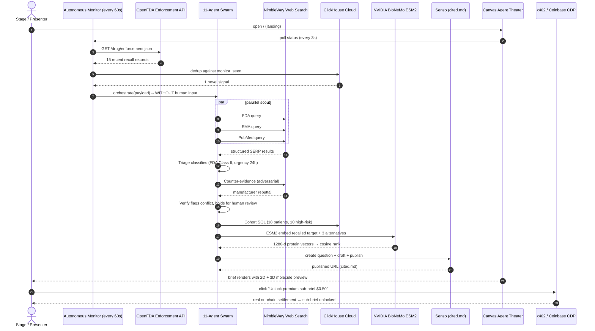
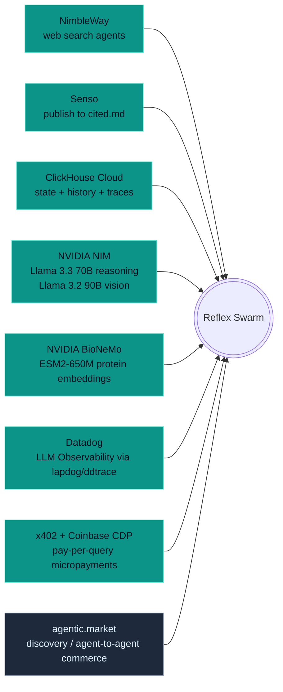
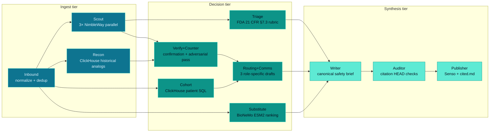
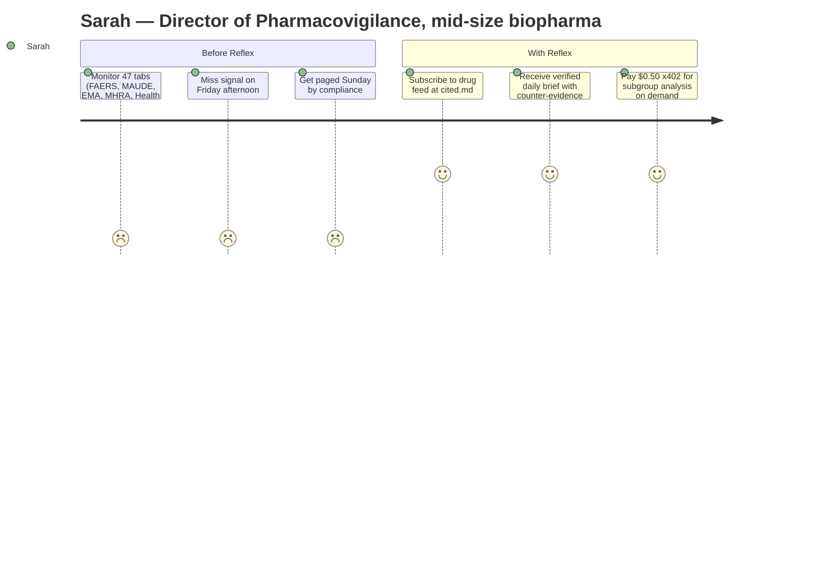
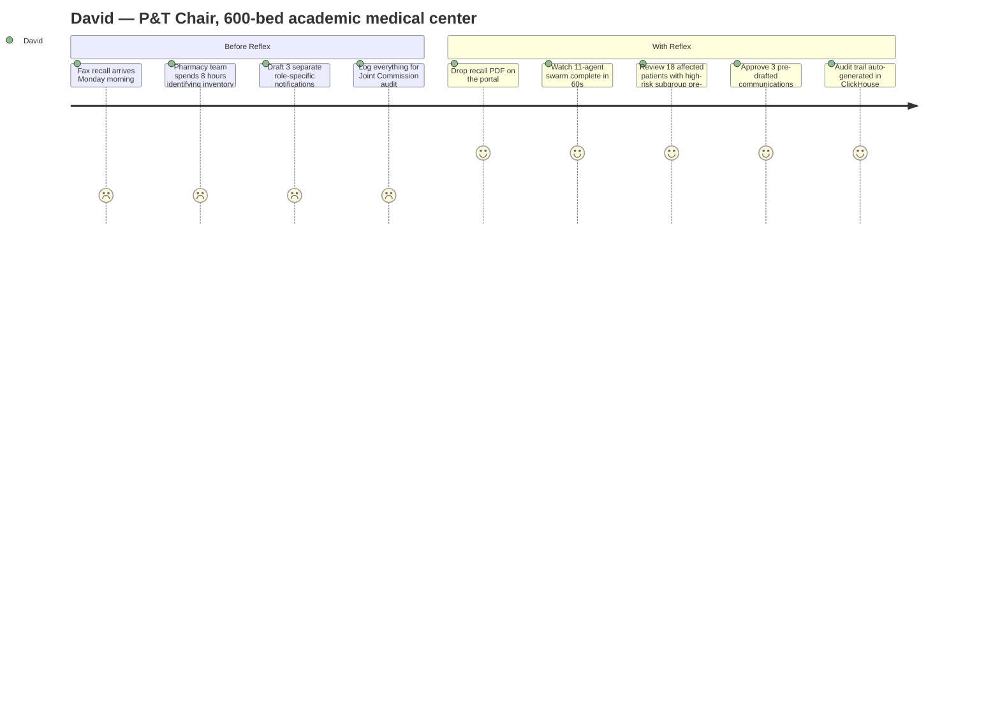
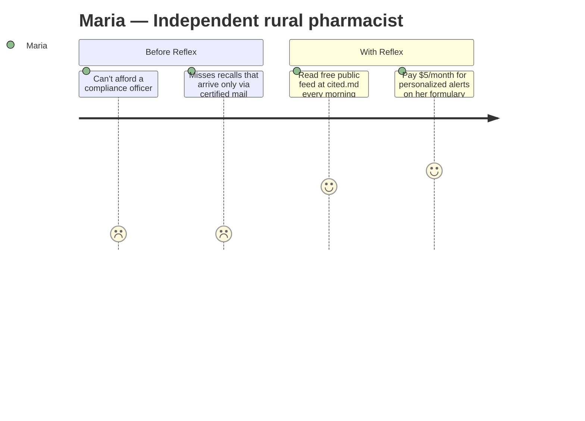
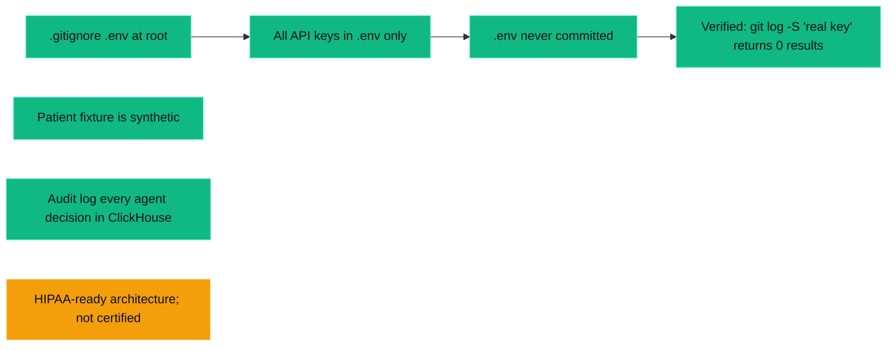

# Reflex

> **The autonomous safety reflex for healthcare systems.**
> An always-on agent swarm that turns FDA drug recalls and pharmacovigilance signals into verified, cited, routed operational deliverables — in seconds, not weeks.

Most drug-safety operations still run on faxes. When the FDA issues a recall, pharmacists at every U.S. hospital manually verify the alert, identify affected patients, draft clinician memos, and log compliance — a process that takes days to weeks while patients keep taking the drug. **Mass General Brigham tried to automate this in 2024 and abandoned deployment because false positives caused unacceptable patient anxiety.** Verification — not detection — is the unsolved problem.

Reflex's contribution is a multi-agent verification swarm with an **active counter-evidence agent** that cross-references every recall claim against multiple independent regulatory sources, including the manufacturer's own rebuttal channels, before any clinician or patient is notified. When a recall is confirmed, Reflex also runs an 11th **substitution agent** that uses NVIDIA BioNeMo protein embeddings to rank therapeutic alternatives by molecular target similarity — turning a recall notice into both a "stop" signal and a "swap to this" recommendation.

---

## What you see in 90 seconds



The autonomous monitor fires the swarm **without a click**. The Canvas Agent Theater animates 11 agent nodes + 6 source nodes with cursors that physically travel between them. The brief shows the recalled drug's 2D chemical structure beside its 3D target protein, plus three ranked therapeutic alternatives — each with their own molecular previews.

---

## Sponsor stack



| Sponsor | Role | Where it shows in the demo |
|---|---|---|
| **NimbleWay** | Real-time web search across FDA, EMA, PubMed + counter-evidence sources | Scout fans out 3 parallel queries; Counter agent runs the adversarial search |
| **Senso** | Real `apiv2.senso.ai/api/v1` calls to create questions + drafts + publish to `cited.md` | Every brief produces a real draft visible in your Senso dashboard |
| **ClickHouse Cloud** | Patient cohort SQL (fuzzy-match), historical analog search, agent trace ledger, autonomous-monitor dedup | Cohort agent finds 18 metformin patients via real `clickhouse-connect` SQL |
| **NVIDIA NIM** | Llama 3.3 70B for reasoning agents; Llama 3.2 90B vision for PDF/image entity extraction | OpenAI-compatible client, `ddtrace`-instrumented for Datadog LLM Obs |
| **NVIDIA BioNeMo** | ESM2-650M protein embeddings → 1280-d vectors → cosine similarity ranking | Substitute agent embeds target + 3 alternative targets, ranks them |
| **Datadog** | LLM Observability via `ddtrace-run` auto-instrumentation | Every NIM call appears as a span without per-call wiring |
| **x402 + Coinbase CDP** | Premium sub-brief paywall; Base Sepolia chain verification | Real $0.50 pay-per-query with HS256 JWT dev fallback |
| **agentic.market** | Agent-discoverable listing surface for the brief feed | Reflex publishes briefs that other agents can find and subscribe to |

7 sponsors, well over the "2+ required" threshold.

---

## System architecture

```mermaid

graph TB
    subgraph TRIGGERS[Triggers — any of these starts a workflow]
        T1[Autonomous Monitor<br/>OpenFDA poll, 60s]
        T2[PDF / Image Upload<br/>server-side vision]
        T3[Manual API POST]
    end

    subgraph CORE[FastAPI + asyncio]
        ORC[Orchestrator]
        EVT[Trace Bus<br/>asyncio.Queue per workflow]
        SSE[SSE /api/v1/events]
    end

    subgraph SWARM[11-Agent Swarm]
        A1[1 Inbound]
        A2[2 Scout]
        A3[3 Triage]
        A4[4 Recon]
        A5[5 Verify+Counter]
        A6[6 Cohort]
        A7[7 Substitute]
        A8[8 Routing+Comms]
        A9[9 Writer]
        A10[10 Auditor]
        A11[11 Publisher]
    end

    subgraph EXT[External services]
        NIM[NVIDIA NIM<br/>OpenAI-compatible]
        BIO[NVIDIA BioNeMo<br/>ESM2-650M]
        NIMB[NimbleWay SERP]
        CHC[ClickHouse Cloud]
        SEN[Senso v2 API + git mirror]
        FDA[OpenFDA]
        CDP[Coinbase CDP<br/>Base Sepolia]
    end

    subgraph WEB[Next.js 14 Frontend]
        L[/ landing]
        W[/workflow/:id<br/>Canvas Agent Theater]
        B[/brief/:id<br/>2D + 3D molecule preview]
        P[/premium<br/>x402 paywall]
    end

    T1 --> ORC
    T2 --> ORC
    T3 --> ORC
    T1 --> FDA
    T2 --> NIM
    ORC --> A1 --> A2 --> A3 --> A4 --> A5 --> A6 --> A7 --> A8 --> A9 --> A10 --> A11
    A2 --> NIMB
    A4 --> CHC
    A5 --> NIMB
    A6 --> CHC
    A7 --> NIM
    A7 --> BIO
    A11 --> SEN
    A11 --> CHC
    A1 -.LLM call.-> NIM
    A3 -.LLM call.-> NIM
    A5 -.LLM call.-> NIM
    A8 -.LLM call.-> NIM
    A9 -.LLM call.-> NIM
    ORC --> EVT --> SSE
    SSE --> W
    P --> CDP
    A11 --> CHC

    classDef agent fill:#0D9488,stroke:#5EEAD4,color:#06101F
    classDef ext fill:#1e3a5f,stroke:#5EEAD4,color:#E0F2FE
    classDef ui fill:#7c3aed,stroke:#c4b5fd,color:#fff
    class A1,A2,A3,A4,A5,A6,A7,A8,A9,A10,A11 agent
    class NIM,BIO,NIMB,CHC,SEN,FDA,CDP ext
    class L,W,B,P ui
```

---

## The 11 agents



Each agent is one Python file in `apps/api/agents/`. Each has a precise role + rubric in its system prompt (see `apps/api/agents/*.py`).

---

## User personas — three real stories







---

## File map

```
reflexagent/
├── README.md                       # this file
├── ARCHITECTURE.md                 # deeper technical doc with mermaid diagrams
├── .env.example                    # all configurable settings
├── Makefile                        # install / init-db / dev / api / web / seed
├── docker-compose.yml              # (optional) local ClickHouse
├── apps/
│   ├── api/                        # FastAPI backend
│   │   ├── main.py                 # routes, startup hooks, CORS
│   │   ├── orchestrator.py         # 11-agent swarm scheduler
│   │   ├── monitor.py              # autonomous OpenFDA poller
│   │   ├── events.py               # SSE per-workflow + global feed
│   │   ├── payments.py             # x402 challenge + Coinbase CDP verify
│   │   ├── settings.py             # pydantic-settings (.env)
│   │   ├── schemas.py              # pydantic models for every agent
│   │   ├── agents/                 # 11 specialized agents
│   │   │   ├── inbound.py          # normalize + dedup
│   │   │   ├── scout.py            # 3× NimbleWay parallel
│   │   │   ├── triage.py           # FDA classification
│   │   │   ├── recon.py            # historical analogs (ClickHouse)
│   │   │   ├── verify_counter.py   # adversarial counter-evidence
│   │   │   ├── cohort.py           # patient SQL
│   │   │   ├── substitute.py       # BioNeMo ESM2 substitution
│   │   │   ├── routing_comms.py    # 3 role-specific drafts
│   │   │   ├── writer.py           # canonical brief
│   │   │   ├── auditor.py          # citation HEAD verification
│   │   │   └── publisher.py        # Senso + git mirror
│   │   └── tools/                  # external service clients
│   │       ├── reasoning.py        # NIM (OpenAI-compatible)
│   │       ├── biology.py          # NVIDIA BioNeMo ESM2-650M
│   │       ├── nimble.py           # NimbleWay SERP
│   │       ├── clickhouse_client.py# CH Cloud + in-memory fallback
│   │       ├── senso.py            # Senso v2 + git mirror
│   │       └── trace.py            # ClickHouse + SSE event bus
│   └── web/                        # Next.js 14 App Router frontend
│       ├── app/
│       │   ├── page.tsx            # landing — monitor status + triggers
│       │   ├── workflow/[id]/      # live workflow + Canvas Agent Theater
│       │   ├── brief/[id]/         # published brief + molecule preview
│       │   └── premium/            # x402 pay-per-query
│       └── components/
│           ├── AgentTheater.tsx    # 600-line canvas viz, RAF loop
│           ├── MoleculePreview.tsx # 3Dmol.js + PubChem 2D
│           ├── Narrator.tsx        # browser TTS (SpeechSynthesis)
│           ├── MonitorStatus.tsx
│           ├── RecentWorkflows.tsx
│           └── TriggerPanel.tsx
├── infra/
│   ├── clickhouse/init.sql         # all DDL (idempotent)
│   └── seed/
│       ├── seed_patients.py        # 50 synthetic patients
│       ├── seed_adverse_events.py  # 220 historical events
│       └── nimble_cache.json       # canonical responses for demo failsafe
├── scripts/
│   ├── start-all.sh                # ddtrace-run uvicorn + npm dev
│   └── init-db.sh                  # one-shot schema + seed
└── docs/
    ├── cited/                      # autonomous-published briefs (git-mirrored)
    └── superpowers/
        └── specs/                  # design spec
```

---

## Running locally

### Prerequisites

- Python 3.12+
- Node.js 20+
- A ClickHouse Cloud instance (free tier works) — see ARCHITECTURE.md for the auto-discovery script
- (Optional) `lapdog` for Datadog auto-instrumentation: `brew install datadog/lapdog/lapdog`
- API keys for NimbleWay, Senso, NVIDIA NIM, NVIDIA BioNeMo, Datadog

### Setup

```bash
git clone https://github.com/roshaninfordham/reflexagent.git
cd reflexagent
cp .env.example .env
# Edit .env with your keys (see ARCHITECTURE.md for each)

# Backend
make install         # creates .venv and installs deps
make init-db         # initializes ClickHouse schema + seeds patients + history

# Run everything in one terminal
make dev             # spawns API on :8000 (under ddtrace-run) + web on :3000
```

Open `http://localhost:3000`. The autonomous monitor is already polling OpenFDA — within 60 seconds you should see a real recall surface and trigger the swarm.

---

## Security



What Reflex claims honestly:
- Edge ingestion (when used) means raw images don't leave the device.
- Patient cohort fixture is synthetic; no real PHI in the demo.
- Every agent decision audit-logged to ClickHouse `agent_traces`.
- Senso publication is opt-in per recall.

What Reflex doesn't claim:
- Not HIPAA-certified.
- Not a substitute for licensed clinician judgment.
- The patient data in the demo is synthetic.

---

## Observability

```mermaid

flowchart LR
    classDef dd fill:#632ca6,stroke:#a78bfa,color:#fff
    classDef ch fill:#fcdc00,stroke:#94A3B8,color:#06101F
    classDef ui fill:#0D9488,stroke:#5EEAD4,color:#06101F

    R[Every reasoning() call]
    R --> DD[Datadog LLM Observability<br/>via ddtrace-run]:::dd
    R --> CH[ClickHouse agent_traces<br/>via trace_span]:::ch
    CH --> UI[SSE → Canvas Agent Theater<br/>+ event ticker]:::ui

    DD -.-> DOC[Datadog dashboard:<br/>span tree + cost + latency]
    CH -.-> SQL[ad-hoc SQL on workflow history]
```

Two tiers of observability, both visible on stage:
1. **Datadog LLM Observability** — auto-captured via `ddtrace-run uvicorn ...`. Every NIM call appears as a span with the model name, token counts, latency, and cost.
2. **ClickHouse `agent_traces`** — same data persisted for SLA/audit, plus streamed via SSE to the Canvas Agent Theater so the UI animates each agent's call as it happens.

---

## License

MIT.
